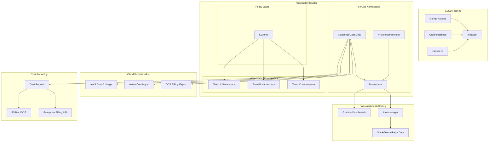

# Design Document: FinOps Feature

## Overview

The FinOps feature provides comprehensive cloud cost management, visibility, and governance capabilities for multi-cloud Kubernetes environments within the CI/CD reference architecture. This feature integrates industry-standard cost monitoring tools (Kubecost/OpenCost), resource optimization recommendations (VPA), policy-driven governance (Kyverno), infrastructure cost estimation (Infracost), and chargeback/showback patterns to enable platform engineering teams and FinOps practitioners to track, optimize, and allocate cloud spending effectively.

### Key Capabilities

- **Real-time Cost Monitoring**: Deploy Kubecost or OpenCost for granular cost visibility per namespace, workload, and team
- **Resource Rightsizing**: Integrate VPA recommendations with cost impact analysis to identify optimization opportunities
- **Policy-Driven Governance**: Extend Kyverno policies to enforce cost-related rules and prevent expensive misconfigurations
- **Infrastructure Cost Estimation**: Enhance CI/CD pipelines with Infracost to surface cost changes before deployment
- **Chargeback/Showback**: Generate cost allocation reports for accurate team billing or cost transparency
- **Budget Management**: Configure budget thresholds with automated alerting when spending exceeds limits
- **Multi-Cloud Normalization**: Consistent cost visibility across AWS, Azure, and GCP
- **Anomaly Detection**: Automated alerts for unexpected cost spikes
- **Golden Path Integration**: Embed FinOps checkpoints into standard development workflows

### Design Principles

1. **Vendor Neutrality**: Support both Kubecost and OpenCost to avoid vendor lock-in
2. **Multi-Cloud First**: Normalize cost data across AWS, Azure, and GCP
3. **Policy as Code**: All governance rules defined declaratively in version control
4. **Shift-Left Cost Awareness**: Surface cost implications early in the development lifecycle
5. **Automation by Default**: Minimize manual intervention through automated recommendations and alerts
6. **Incremental Adoption**: Support showback before chargeback to ease organizational change
7. **Integration Over Replacement**: Extend existing tools (Prometheus, Grafana, Kyverno) rather than introducing new platforms

## Architecture

### High-Level Architecture



### Component Architecture

The FinOps system consists of five primary layers:

1. **Cost Collection Layer**: Kubecost/OpenCost collects resource usage metrics and integrates with cloud provider billing APIs
2. **Policy Enforcement Layer**: Kyverno validates cost-related policies at admission time
3. **Optimization Layer**: VPA generates rightsizing recommendations with cost impact analysis
4. **Alerting Layer**: Prometheus Alertmanager triggers notifications for budget thresholds and anomalies
5. **Reporting Layer**: Scripts generate chargeback/showback reports and export to external systems

### Data Flow

1. **Cost Data Collection**:
   - Kubecost/OpenCost scrapes Kubernetes metrics from Prometheus
   - Cloud provider billing APIs provide actual pricing data
   - Cost data is aggregated by namespace, label, and workload
   - Metrics are exposed in Prometheus format for querying

2. **Policy Enforcement**:
   - Kyverno intercepts Pod/Deployment creation requests
   - Policies validate required cost labels (finops.org/costcenter, finops.org/environment)
   - Policies enforce resource limits based on team budgets
   - Violations return descriptive error messages with remediation steps

3. **Optimization Recommendations**:
   - VPA analyzes historical resource usage (24-48 hours minimum)
   - Recommendations are enriched with cost impact using Kubecost/OpenCost pricing data
   - Reports rank opportunities by potential monthly savings
   - High-priority recommendations (>20% savings) are highlighted

4. **Budget Alerting**:
   - Prometheus evaluates alerting rules against cost metrics
   - Alerts trigger at 80%, 100%, and 120% of configured thresholds
   - Notifications include cost center, current spend, and Grafana dashboard links
   - Integrations with Slack, Microsoft Teams, and PagerDuty

5. **Cost Reporting**:
   - Scheduled jobs generate monthly cost reports in CSV/JSON formats
   - Reports aggregate costs by cost center across all namespaces
   - Shared cluster costs are allocated proportionally by resource usage
   - Reports are exported to S3/Blob/GCS and enterprise billing systems

## Components and Interfaces

### 1. Cost Monitoring Component (Kubecost/OpenCost)

**Purpose**: Provide real-time Kubernetes cost visibility with cloud provider pricing integration.

**Key Interfaces**:
- **Input**: Prometheus metrics, cloud provider billing APIs (AWS CUR, Azure Cost Management, GCP Billing Export)
- **Output**: Cost metrics in Prometheus format, web UI for cost exploration
- **Configuration**: Helm values for cloud provider credentials, Prometheus endpoint, retention period

**Implementation Details**:
- Deploy to dedicated `finops` namespace
- Configure Prometheus as data source
- Enable cloud provider integrations with appropriate IAM roles/service principals
- Expose web UI via Kubernetes Ingress with TLS
- Configure data retention (default: 90 days)

**Technology Choice**:
- **OpenCost**: CNCF project, vendor-neutral, free, suitable for organizations prioritizing open standards
- **Kubecost**: Built on OpenCost, adds enterprise features (multi-cluster, advanced reporting), suitable for organizations needing commercial support

### 2. Vertical Pod Autoscaler (VPA)

**Purpose**: Generate resource sizing recommendations based on historical usage patterns.

**Key Interfaces**:
- **Input**: Kubernetes metrics from Metrics Server
- **Output**: VPA recommendations (target, lower bound, upper bound) per container
- **Configuration**: VPA objects in `Off` mode (recommendation-only, no automatic updates)

**Implementation Details**:
- Deploy VPA components (recommender, updater, admission controller)
- Create VPA objects for all workloads in recommendation mode
- Minimum 24-48 hours of data required for meaningful recommendations
- Recommendations use decaying weighted histograms, not simple averages

### 3. Cost Impact Analyzer

**Purpose**: Enrich VPA recommendations with cost implications using pricing data.

**Key Interfaces**:
- **Input**: VPA recommendations, Kubecost/OpenCost pricing API
- **Output**: Rightsizing reports with current cost, recommended cost, potential savings
- **Configuration**: Script parameters for namespace filter, savings threshold

**Implementation Details**:
- Python/Bash script that queries VPA API and Kubecost/OpenCost API
- Calculates cost difference: `(recommended_cpu - current_cpu) * cpu_hourly_rate + (recommended_memory - current_memory) * memory_hourly_rate`
- Generates report in JSON/CSV format
- Highlights recommendations with >20% potential savings as high-priority

### 4. Kyverno Policy Extensions

**Purpose**: Enforce cost governance rules at admission time to prevent expensive misconfigurations.

**Key Policies**:

1. **Require Cost Labels**: Validate presence of `finops.org/costcenter` and `finops.org/environment` labels on all Pods
2. **Enforce Resource Limits**: Block Pods exceeding namespace budget-based resource limits
3. **GPU Approval Gate**: Require explicit approval annotation for GPU workloads
4. **PDB for Large Workloads**: Require PodDisruptionBudget for workloads >4 CPU or >8Gi memory

**Key Interfaces**:
- **Input**: Pod/Deployment admission requests
- **Output**: Admission decision (allow/deny) with violation message
- **Configuration**: ClusterPolicy YAML files with cost governance rules

**Implementation Details**:
- Policies deployed as Kyverno ClusterPolicy resources
- Validation mode (blocking) for production, audit mode for testing
- Error messages include policy name, violation reason, and remediation steps
- Policies versioned in Git alongside other Kyverno policies

### 5. Infracost Integration

**Purpose**: Surface infrastructure cost estimates in CI/CD pipelines before deployment.

**Key Interfaces**:
- **Input**: Terraform plan files
- **Output**: Cost estimate comments on pull requests, PR check status
- **Configuration**: Workflow templates for GitHub Actions, Azure Pipelines, GitLab CI

**Implementation Details**:
- Infracost runs after `terraform plan` in CI/CD pipeline
- Generates cost breakdown showing monthly cost impact
- Posts comment to PR with cost diff (additions, deletions, changes)
- Fails PR check if cost increase exceeds configurable threshold (e.g., 20%)
- Configuration file per repository defines cost increase thresholds

### 6. Budget Alerting System

**Purpose**: Notify teams when spending exceeds configured budget thresholds.

**Key Interfaces**:
- **Input**: Cost metrics from Prometheus, budget configuration file
- **Output**: Alerts to Slack/Teams/PagerDuty with cost details and dashboard links
- **Configuration**: Budget thresholds per cost center in YAML format

**Implementation Details**:
- Budget configuration: `budgets.yaml` with cost center, monthly threshold, alert channels
- Prometheus alerting rules evaluate cost metrics against thresholds
- Three alert levels: 80% (warning), 100% (critical), 120% (emergency)
- Alert payload includes: cost center, current spend, threshold, percentage over budget, Grafana dashboard URL
- Alertmanager routes alerts to appropriate channels based on cost center

### 7. Chargeback/Showback Reporting

**Purpose**: Generate cost allocation reports for team billing or cost transparency.

**Key Interfaces**:
- **Input**: Cost data from Kubecost/OpenCost API
- **Output**: Monthly cost reports in CSV/JSON format
- **Configuration**: Report schedule, output format, export destinations

**Implementation Details**:
- Scheduled CronJob (monthly) queries Kubecost/OpenCost API
- Report columns: cost center, namespace, total cost, compute cost, storage cost, network cost
- Shared cluster costs (control plane, monitoring, logging) allocated proportionally by namespace resource usage
- Reports exported to S3/Blob/GCS for archival
- REST API integration code for enterprise billing systems (SAP, Oracle Financials)
- **Showback**: Reports shared with teams for visibility, no actual billing
- **Chargeback**: Reports used for internal billing/cost allocation

### 8. Cost Anomaly Detection

**Purpose**: Alert on unexpected cost spikes for rapid investigation and response.

**Key Interfaces**:
- **Input**: Cost metrics from Prometheus
- **Output**: Anomaly alerts to Slack/Teams/PagerDuty
- **Configuration**: Prometheus alerting rules with anomaly thresholds

**Implementation Details**:
- Alerting rule: Cost increase >50% compared to 7-day rolling average
- Alerting rule: New namespace with cost >$100 within 24 hours of creation
- Alert payload includes: namespace, current cost, baseline cost, percentage increase, cost breakdown link
- Grafana dashboard displays anomalies over past 30 days with trend analysis

### 9. Grafana Dashboards

**Purpose**: Visualize cost data, trends, and optimization opportunities.

**Key Dashboards**:

1. **Cost Overview**: Total cluster cost, cost by namespace, cost by team, 7/30/90-day trends
2. **Cost Breakdown**: Compute vs storage vs network costs, cost by workload type
3. **Rightsizing Opportunities**: Top 10 optimization opportunities ranked by potential savings
4. **Budget Tracking**: Current spend vs budget by cost center, forecast to month-end
5. **Anomaly Detection**: Cost spikes, new high-cost namespaces, unusual patterns
6. **Tag Compliance**: Percentage of pods with required cost labels, non-compliant resources
7. **Multi-Cloud Comparison**: Cost comparison across AWS, Azure, GCP in normalized USD

**Implementation Details**:
- Dashboards defined as JSON files in Git
- Deployed via Grafana provisioning or ConfigMaps
- Prometheus as data source for cost metrics
- Query performance: <5 seconds for 90-day queries

### 10. Golden Path Integration

**Purpose**: Embed FinOps checkpoints into standard development workflows.

**Integration Points**:

1. **kubernetes-microservice Golden Path**:
   - Step: Review VPA recommendations before production deployment
   - Step: Verify `finops.org/costcenter` and `finops.org/environment` labels present
   - Step: Confirm resource requests align with team budget

2. **serverless-app Golden Path**:
   - Step: Review Infracost estimates in PR
   - Step: Approve cost increases >20%

3. **PR Template Checklist**:
   - [ ] FinOps labels applied to all resources
   - [ ] Infracost estimate reviewed
   - [ ] VPA recommendations considered
   - [ ] Cost impact documented for significant changes

**Implementation Details**:
- Updated golden path documentation with FinOps checkpoint steps
- PR template includes FinOps checklist
- Documentation explains when to perform FinOps reviews (pre-production, major changes)

## Data Models

### Cost Metric Schema

Cost metrics exposed in Prometheus format:

```
# Namespace cost (USD per hour)
kubecost_namespace_cost_hourly{namespace="team-a", cost_center="engineering", environment="production"} 12.50

# Workload cost (USD per hour)
kubecost_workload_cost_hourly{namespace="team-a", workload="api-server", workload_type="deployment"} 3.25

# Resource type cost breakdown (USD per hour)
kubecost_namespace_compute_cost_hourly{namespace="team-a"} 8.00
kubecost_namespace_storage_cost_hourly{namespace="team-a"} 3.00
kubecost_namespace_network_cost_hourly{namespace="team-a"} 1.50

# Budget metrics
finops_budget_threshold{cost_center="engineering"} 10000.00
finops_budget_current_spend{cost_center="engineering"} 8500.00
finops_budget_utilization_percent{cost_center="engineering"} 85.0
```

### Budget Configuration Schema

```yaml
budgets:
  - cost_center: "engineering"
    monthly_threshold_usd: 10000
    alert_channels:
      - slack: "#finops-engineering"
      - email: "engineering-leads@company.com"
    
  - cost_center: "data-science"
    monthly_threshold_usd: 25000
    alert_channels:
      - slack: "#finops-data-science"
      - pagerduty: "data-science-oncall"
```

### Cost Report Schema

```json
{
  "report_id": "2025-01",
  "report_period": {
    "start": "2025-01-01T00:00:00Z",
    "end": "2025-01-31T23:59:59Z"
  },
  "cluster_name": "prod-us-east-1",
  "cloud_provider": "aws",
  "currency": "USD",
  "cost_centers": [
    {
      "cost_center": "engineering",
      "namespaces": ["team-a", "team-b"],
      "total_cost": 8500.00,
      "compute_cost": 5500.00,
      "storage_cost": 2000.00,
      "network_cost": 1000.00,
      "shared_cost_allocation": 500.00
    }
  ],
  "shared_costs": {
    "control_plane": 2000.00,
    "monitoring": 500.00,
    "logging": 300.00,
    "allocation_method": "proportional_by_resource_usage"
  }
}
```

### Rightsizing Recommendation Schema

```json
{
  "report_id": "rightsizing-2025-01-15",
  "generated_at": "2025-01-15T10:00:00Z",
  "namespace": "team-a",
  "recommendations": [
    {
      "workload_name": "api-server",
      "workload_type": "deployment",
      "container_name": "app",
      "current_resources": {
        "cpu_request": "2000m",
        "memory_request": "4Gi"
      },
      "recommended_resources": {
        "cpu_request": "1000m",
        "memory_request": "2Gi"
      },
      "current_monthly_cost_usd": 120.00,
      "recommended_monthly_cost_usd": 60.00,
      "potential_monthly_savings_usd": 60.00,
      "savings_percentage": 50.0,
      "priority": "high",
      "confidence": "high",
      "data_period_days": 30
    }
  ]
}
```

### Cost Label Schema

Required labels for all Pods:

```yaml
metadata:
  labels:
    finops.org/costcenter: "engineering"  # Required: Cost center for chargeback
    finops.org/environment: "production"  # Required: Environment (dev/staging/production)
    finops.org/team: "platform"           # Optional: Team name
    finops.org/project: "api-gateway"     # Optional: Project identifier
```

### Infracost Configuration Schema

```yaml
# .infracost.yml per repository
version: 0.1

projects:
  - path: terraform/
    name: production-infrastructure
    
cost_thresholds:
  percentage_increase: 20  # Fail PR if cost increases >20%
  absolute_increase_usd: 500  # Fail PR if cost increases >$500/month
  
currency: USD
```

## Error Handling

### Kyverno Policy Violations

When a cost policy is violated, Kyverno returns a structured error message:

```
Error from server: admission webhook "validate.kyverno.svc" denied the request:

Policy: require-cost-labels
Rule: validate-costcenter-label
Message: Pod is missing required label 'finops.org/costcenter'
Remediation: Add the label 'finops.org/costcenter' with your team's cost center identifier.
Example:
  metadata:
    labels:
      finops.org/costcenter: "engineering"
```

### Cost Monitoring Failures

**Scenario**: Kubecost/OpenCost cannot connect to cloud provider billing API

**Detection**: Prometheus alert `CostMonitoringDataStale` fires when no new cost data received for 6 hours

**Response**:
1. Alert sent to platform team via PagerDuty
2. Runbook link included in alert for troubleshooting steps
3. Fallback to on-demand pricing estimates until connection restored
4. Cost reports include warning about data accuracy

### VPA Recommendation Failures

**Scenario**: VPA has insufficient data to generate recommendations

**Detection**: VPA status shows `RecommendationNotAvailable`

**Response**:
1. Cost impact analyzer skips workload with warning in report
2. Minimum 24-48 hours of data required message displayed
3. Recommendation retried in next report generation cycle

### Budget Alert Failures

**Scenario**: Alertmanager cannot deliver budget alert to Slack

**Detection**: Alertmanager logs show delivery failure

**Response**:
1. Alert retried with exponential backoff (1m, 5m, 15m)
2. Fallback to email notification if Slack unavailable
3. Alert visible in Alertmanager UI for manual review
4. Platform team notified of delivery failure

### Infracost Failures

**Scenario**: Infracost cannot estimate cost due to unsupported Terraform resource

**Detection**: Infracost exits with non-zero status code

**Response**:
1. PR check marked as warning (not failure)
2. Comment posted with partial cost estimate and unsupported resources list
3. Manual review required for unsupported resources
4. Documentation link provided for cost estimation guidance

### Cost Report Export Failures

**Scenario**: Cost report cannot be exported to S3 due to permission error

**Detection**: Export script exits with error, CronJob shows failed status

**Response**:
1. Alert sent to platform team
2. Report saved locally in pod for manual retrieval
3. Runbook includes steps to verify IAM role/service principal permissions
4. Export retried in next scheduled run

## Testing Strategy

### Unit Testing

**Scope**: Individual scripts, policy logic, cost calculation functions

**Test Cases**:

1. **Cost Impact Calculation**:
   - Test cost difference calculation with various CPU/memory values
   - Test handling of missing pricing data
   - Test savings percentage calculation
   - Test priority classification (high/medium/low)

2. **Budget Threshold Evaluation**:
   - Test alert triggering at 80%, 100%, 120% thresholds
   - Test handling of missing budget configuration
   - Test cost center matching logic

3. **Cost Report Generation**:
   - Test CSV/JSON formatting
   - Test shared cost allocation calculation
   - Test handling of namespaces without cost labels
   - Test date range filtering

4. **Tag Validation**:
   - Test detection of missing required labels
   - Test compliance percentage calculation
   - Test namespace filtering

5. **Infracost Threshold Evaluation**:
   - Test percentage increase calculation
   - Test absolute increase calculation
   - Test PR check status determination

**Testing Approach**:
- Python unit tests using `pytest` for Python scripts
- Bash unit tests using `bats` (Bash Automated Testing System) for shell scripts
- Mock Kubernetes API responses using `kubectl` test fixtures
- Mock Kubecost/OpenCost API responses using HTTP mocking libraries

### Integration Testing

**Scope**: Component interactions, API integrations, end-to-end workflows

**Test Cases**:

1. **Kubecost/OpenCost Integration**:
   - Deploy cost monitoring tool to test cluster
   - Verify Prometheus scraping configuration
   - Verify cloud provider API connectivity (using test credentials)
   - Verify cost metrics exposed at `/metrics` endpoint
   - Verify web UI accessibility via Ingress

2. **VPA Integration**:
   - Deploy VPA to test cluster
   - Create test workloads with known resource patterns
   - Verify VPA generates recommendations after 24 hours
   - Verify cost impact analyzer enriches recommendations with pricing data

3. **Kyverno Policy Enforcement**:
   - Deploy Kyverno policies to test cluster
   - Attempt to create Pods without required cost labels (expect rejection)
   - Attempt to create Pods exceeding resource limits (expect rejection)
   - Attempt to create GPU workloads without approval (expect rejection)
   - Verify error messages include remediation steps

4. **Budget Alerting**:
   - Configure test budget with low threshold
   - Generate synthetic cost metrics exceeding threshold
   - Verify Prometheus alert fires
   - Verify Alertmanager delivers notification to test Slack channel
   - Verify alert includes dashboard link

5. **Cost Report Generation**:
   - Run cost report script against test cluster
   - Verify report includes all expected cost centers
   - Verify shared cost allocation calculation
   - Verify export to test S3 bucket

6. **Infracost CI/CD Integration**:
   - Create test PR with Terraform changes
   - Verify Infracost runs in CI/CD pipeline
   - Verify cost estimate comment posted to PR
   - Verify PR check status reflects cost threshold evaluation

7. **Anomaly Detection**:
   - Generate synthetic cost spike (>50% increase)
   - Verify anomaly alert fires
   - Verify alert includes baseline and current cost
   - Verify Grafana dashboard displays anomaly

**Testing Approach**:
- Use ephemeral test Kubernetes cluster (kind, k3s, or cloud-managed cluster)
- Deploy all FinOps components to test cluster
- Use test cloud provider accounts with limited permissions
- Automate integration tests in CI/CD pipeline
- Clean up test resources after each test run

### End-to-End Testing

**Scope**: Complete workflows from development to production

**Test Scenarios**:

1. **Developer Workflow**:
   - Developer creates new microservice following kubernetes-microservice golden path
   - Developer adds required FinOps labels to Kubernetes manifests
   - Developer creates PR with Terraform infrastructure changes
   - Infracost runs and posts cost estimate to PR
   - Developer reviews VPA recommendations before production deployment
   - Kyverno validates cost labels at deployment time
   - Cost data appears in Grafana dashboards within 5 minutes
   - Monthly cost report includes new workload

2. **FinOps Practitioner Workflow**:
   - FinOps practitioner configures budget for new team
   - Team deploys workloads to new namespace
   - Cost data aggregated by cost center
   - Budget alert fires when team exceeds 80% threshold
   - FinOps practitioner reviews rightsizing recommendations
   - FinOps practitioner generates monthly chargeback report
   - Report exported to enterprise billing system

3. **Platform Team Workflow**:
   - Platform team deploys new Kyverno cost policy
   - Policy tested in audit mode (non-blocking)
   - Policy promoted to validation mode (blocking)
   - Platform team investigates cost anomaly alert
   - Platform team reviews cost optimization recommendations
   - Platform team updates budget thresholds based on trends

**Testing Approach**:
- Manual testing in staging environment
- Document test scenarios as runbooks
- Capture screenshots/recordings for documentation
- Validate against acceptance criteria in requirements document

### Performance Testing

**Scope**: Query performance, scalability, resource consumption

**Test Cases**:

1. **Cost Query Performance**:
   - Verify cost queries return results within 5 seconds for 90-day period
   - Test query performance with 100+ namespaces
   - Test query performance with 1000+ workloads

2. **Grafana Dashboard Load Time**:
   - Verify dashboards load within 3 seconds
   - Test dashboard performance with multiple concurrent users

3. **Kyverno Policy Evaluation**:
   - Measure policy evaluation latency (target: <100ms per admission request)
   - Test policy performance with 10+ concurrent Pod creations

4. **Cost Report Generation**:
   - Measure report generation time for 100+ namespaces (target: <5 minutes)
   - Test report generation with 90 days of cost data

**Testing Approach**:
- Use load testing tools (k6, Locust) for concurrent request testing
- Monitor Prometheus metrics during load tests
- Establish performance baselines and regression thresholds

### Security Testing

**Scope**: Access controls, credential management, data privacy

**Test Cases**:

1. **RBAC Validation**:
   - Verify only authorized users can access Kubecost/OpenCost UI
   - Verify only authorized users can modify budget configuration
   - Verify only authorized users can access cost reports

2. **Credential Security**:
   - Verify cloud provider credentials stored in Kubernetes Secrets
   - Verify Secrets not exposed in logs or error messages
   - Verify IAM roles/service principals follow least privilege principle

3. **Data Privacy**:
   - Verify cost reports do not expose sensitive workload data
   - Verify Grafana dashboards respect namespace RBAC
   - Verify cost metrics do not include PII

**Testing Approach**:
- Manual security review of RBAC configurations
- Automated secret scanning with tools like TruffleHog
- Penetration testing of exposed endpoints (Kubecost UI, Grafana)

### Documentation Testing

**Scope**: Accuracy, completeness, usability of documentation

**Test Cases**:

1. **Installation Documentation**:
   - Follow installation steps on clean cluster
   - Verify all components deploy successfully
   - Verify all prerequisites documented

2. **Runbook Validation**:
   - Follow cost spike investigation runbook
   - Follow team onboarding runbook
   - Verify troubleshooting steps resolve common issues

3. **Golden Path Integration**:
   - Follow kubernetes-microservice golden path with FinOps checkpoints
   - Verify FinOps steps integrate smoothly into workflow
   - Verify checklist items clear and actionable

**Testing Approach**:
- Manual walkthrough of documentation by team members unfamiliar with FinOps
- Collect feedback on clarity, completeness, and accuracy
- Update documentation based on feedback

---

**Note on Property-Based Testing**: This FinOps feature is primarily Infrastructure as Code (IaC) and configuration-driven, involving deployment of existing tools (Kubecost, OpenCost, VPA, Kyverno) and integration scripts. Property-based testing is not applicable for this type of feature. Instead, the testing strategy focuses on:

- **Unit tests** for cost calculation logic and script functions
- **Integration tests** for component interactions and API integrations
- **End-to-end tests** for complete workflows
- **Snapshot tests** for Kubernetes manifests and Helm chart outputs
- **Policy validation** for Kyverno rules using Kyverno CLI test framework

The testing approach emphasizes practical validation of integrations, configurations, and workflows rather than universal properties across generated inputs.
