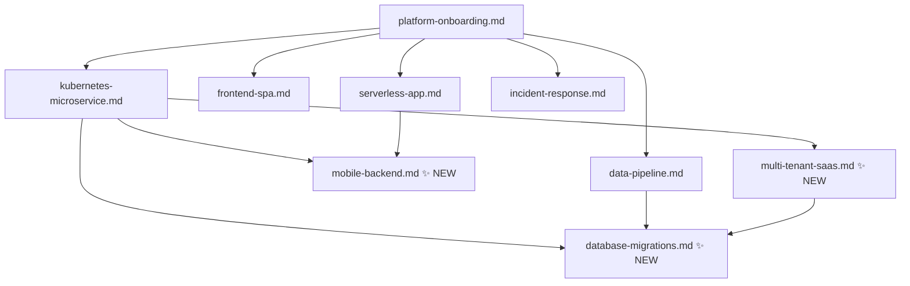
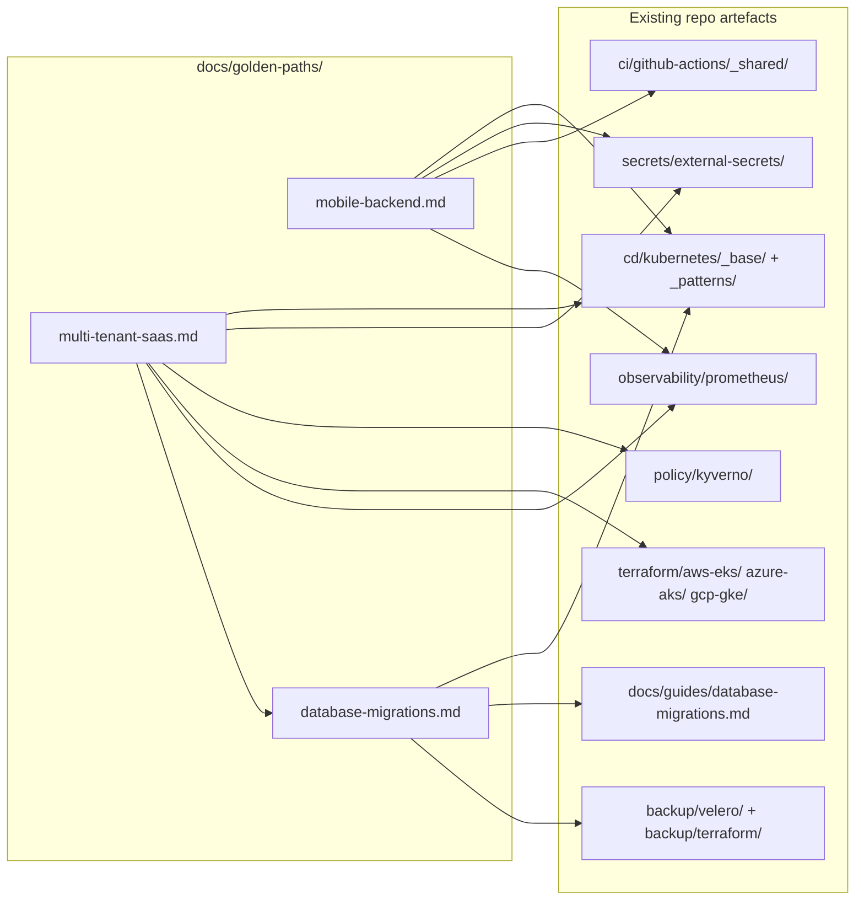
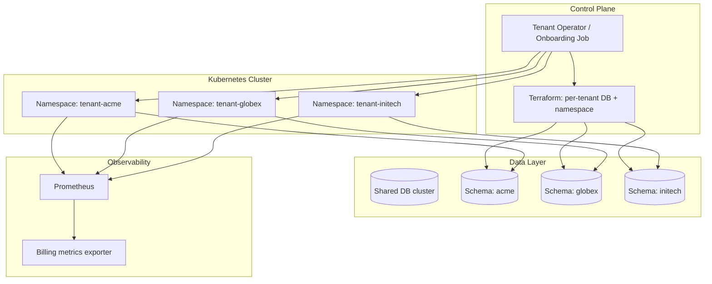

# Design Document: Golden Paths Expansion

## Overview

This feature adds three new golden path documents to `docs/golden-paths/`:

1. **`mobile-backend.md`** — Backend for Frontend (BFF) serving mobile apps: API versioning, OAuth/OIDC auth, push notifications, and rate limiting.
2. **`database-migrations.md`** — Promotes the existing `docs/guides/database-migrations.md` guide into a first-class golden path covering expand/contract patterns, rollback strategies, and zero-downtime migrations.
3. **`multi-tenant-saas.md`** — Isolation patterns, per-tenant namespaces, tenant onboarding automation, and billing instrumentation.

Each document follows the established golden path conventions and cross-links to the existing repo artefacts already in place.

---

## Architecture

### How the three new paths fit into the existing golden path graph



- `mobile-backend` is a specialisation of `kubernetes-microservice` — it adds mobile-specific concerns on top of the standard microservice path.
- `database-migrations` is a promotion of the existing guide into a standalone path; it is referenced by `kubernetes-microservice`, `data-pipeline`, and `multi-tenant-saas`.
- `multi-tenant-saas` builds on `kubernetes-microservice` and depends on `database-migrations` for per-tenant schema isolation.

---

## High-Level Design

### Component Map



### Shared Conventions (all three paths)

All three documents follow the same structural template as the existing six paths:

| Section | Content |
|---------|---------|
| Header | `# Golden Path — <Name>` |
| Subtitle | Standard opinionated workflow subtitle |
| When to use | Bullet criteria + "Not the right path?" cross-links |
| Prerequisites | `bash scripts/env-checker.sh` + tool table |
| Flow | ASCII art pipeline diagram |
| Numbered steps | Code blocks, tables, file references |
| Guardrails | Table of rules and enforcement mechanisms |
| Responsibilities | Developer / Platform team / Security team table |

---

## Low-Level Design: `mobile-backend.md`

### Purpose and Scope

A BFF (Backend for Frontend) for mobile apps differs from a standard microservice in four key areas:

| Concern | Standard microservice | Mobile BFF |
|---------|----------------------|------------|
| API versioning | Optional / semver | Required — old app versions live in the wild for months |
| Auth | Service-to-service mTLS or API keys | OAuth 2.0 / OIDC with PKCE; refresh token rotation |
| Push notifications | Not applicable | APNs (iOS) + FCM (Android) via a notification service |
| Rate limiting | Optional | Required — mobile clients retry aggressively |

### Step Sequence

```
local dev → pre-commit → CI (build + test + scan)
→ Docker image → Kubernetes deploy
→ API versioning strategy → OAuth/OIDC setup
→ Push notification service → rate limiting
→ observability → alerts
```

### Step Detail

**Step 1 — Local development**
Same as `kubernetes-microservice` Step 1: `bash local-dev/kind/setup.sh` + Docker Compose.

**Step 2 — Pre-commit hooks**
Same as all paths: `make hooks`.

**Step 3 — CI pipeline**
Same reusable workflows from `ci/github-actions/_shared/`. Security scans identical to `kubernetes-microservice`.

**Step 4 — Build and push Docker image**
Same reusable `reusable-docker-build.yml`.

**Step 5 — API versioning**

Two supported strategies:

| Strategy | When to use | Implementation |
|----------|-------------|----------------|
| URL path versioning (`/v1/`, `/v2/`) | Default — simple, cache-friendly | Ingress path rewrite rules |
| Header versioning (`Accept: application/vnd.api+json;version=2`) | When URL stability matters | Middleware in the BFF |

URL path versioning is the default. The Ingress manifest uses path-based routing to fan out to versioned Deployments or to a single Deployment that reads the version prefix.

```yaml
# Ingress snippet — route /v1/* and /v2/* to the same BFF Deployment
# The BFF reads the version from the path and adapts the response
rules:
  - http:
      paths:
        - path: /v1/
          pathType: Prefix
          backend:
            service:
              name: mobile-bff
              port:
                number: 8080
        - path: /v2/
          pathType: Prefix
          backend:
            service:
              name: mobile-bff
              port:
                number: 8080
```

Deprecation policy: a version must be supported for at least 12 months after a successor is released. Deprecation is signalled via a `Deprecation` response header.

**Step 6 — OAuth 2.0 / OIDC with PKCE**

Mobile clients use the Authorization Code flow with PKCE (RFC 7636). The BFF acts as the resource server — it validates JWTs issued by the identity provider.

Key files:
- `secrets/external-secrets/` — store the JWKS endpoint URL and client credentials
- The BFF validates the `Authorization: Bearer <token>` header on every request
- Refresh token rotation: the BFF issues a new refresh token on every use and invalidates the old one (prevents token replay)

Identity provider options: Auth0, Keycloak, AWS Cognito, Azure AD B2C. The BFF is provider-agnostic — it only needs the JWKS endpoint.

**Step 7 — Push notifications**

Push notifications are sent via a notification microservice (not the BFF itself). The BFF registers device tokens and triggers notification events.

```
Mobile app → BFF (register device token) → ExternalSecret (APNs key / FCM key)
                                          → Notification service → APNs / FCM
```

Device token storage: a `device_tokens` table in the BFF's database, scoped to `user_id`. Tokens are upserted on every app launch.

**Step 8 — Rate limiting**

Rate limiting is enforced at the Ingress layer using annotations (nginx-ingress) or a dedicated rate-limit policy (if using a service mesh).

```yaml
# nginx-ingress rate limit annotations
nginx.ingress.kubernetes.io/limit-rps: "20"
nginx.ingress.kubernetes.io/limit-connections: "10"
nginx.ingress.kubernetes.io/limit-burst-multiplier: "5"
```

Per-user rate limiting (after auth) is enforced in the BFF middleware using a sliding window counter stored in Redis.

**Step 9 — Observability**

Mobile-specific metrics to track:

| Metric | Alert threshold |
|--------|----------------|
| `http_requests_total{version="v1"}` | Alert when v1 traffic drops to 0 (all clients migrated) |
| `auth_token_validation_errors_total` | Alert on spike (credential stuffing) |
| `push_notification_delivery_failures_total` | Alert when failure rate > 5% |
| `rate_limit_rejections_total` | Alert on sustained spike |

**Step 10 — Guardrails**

| Rule | Enforced by |
|------|-------------|
| PKCE required on all OAuth flows | Code review + integration test |
| Refresh token rotation enabled | Identity provider config |
| API version `Deprecation` header on sunset versions | BFF middleware |
| Rate limiting on all public endpoints | Ingress annotations |
| Device tokens stored encrypted at rest | Database encryption + External Secrets |
| No `latest` image tags | Kyverno `disallow-latest-tag.yaml` |

### Cross-links

- `kubernetes-microservice.md` — base path this extends
- `serverless-app.md` — alternative for lightweight BFFs
- `docs/guides/secrets-management.md` — storing APNs/FCM keys
- `docs/guides/github-actions-oidc.md` — OIDC for CI/CD

---

## Low-Level Design: `database-migrations.md`

### Purpose and Scope

This path promotes `docs/guides/database-migrations.md` from a reference guide into an end-to-end workflow. The guide already covers pattern selection and rollback commands; the golden path adds:

- A clear flow diagram
- CI integration steps (running migrations as a pipeline stage)
- Zero-downtime migration checklist
- Observability for migration runs
- Backup/restore integration

### Step Sequence

```
write migration → test locally (kind) → CI migration check
→ choose pattern (init-container / Job / Helm hook)
→ deploy migration → verify schema → deploy app
→ monitor → rollback procedure (if needed)
```

### Step Detail

**Step 1 — Write the migration**

Every migration must satisfy three rules (from the existing guide):
1. Backwards-compatible (expand/contract pattern)
2. Idempotent
3. Tested locally before pushing

The expand/contract pattern is the core concept — it gets a dedicated section with a four-release timeline diagram.

**Step 2 — Test locally**

```bash
cd local-dev/kind && ./setup.sh
kubectl apply -f cd/kubernetes/_patterns/db-migration-job.yaml
kubectl logs -f job/db-migrate -n default
```

**Step 3 — CI integration**

Migrations run as a dedicated CI step before the Deployment rollout. The step uses the same image as the application (migration scripts are bundled in the image).

```yaml
# .github/workflows/deploy.yml — migration step
- name: Run database migration
  run: |
    kubectl apply -f cd/kubernetes/_patterns/db-migration-job.yaml
    kubectl wait --for=condition=complete job/db-migrate \
      --timeout=600s -n $NAMESPACE
```

**Step 4 — Choose the migration pattern**

The decision tree from `docs/guides/database-migrations.md` is reproduced here as the primary decision point, with direct links to each pattern file.

| Pattern | File | When |
|---------|------|------|
| Init container | `cd/kubernetes/_patterns/db-migration-init-container.yaml` | < 5 min, non-Helm |
| Job | `cd/kubernetes/_patterns/db-migration-job.yaml` | > 5 min, or run-once |
| Helm hook | `cd/kubernetes/_patterns/db-migration-hook.yaml` | Helm-managed apps |

**Step 5 — Zero-downtime checklist**

A checklist table that must be satisfied before running a migration in production:

- [ ] Migration is backwards-compatible (old app version can run against new schema)
- [ ] Migration is idempotent (safe to run twice)
- [ ] Rollback migration script written and tested
- [ ] `activeDeadlineSeconds` set on the Job/init container
- [ ] Database backup taken within the last 24 hours
- [ ] Migration tested on a staging environment with production-scale data volume

**Step 6 — Monitor the migration**

Reuses the monitoring commands from `docs/guides/database-migrations.md` (log tailing, lock detection). Adds a Prometheus alert for migration Job failures:

```yaml
# observability/prometheus/alerts/ — add a migration-specific alert
alert: DatabaseMigrationFailed
expr: kube_job_failed{job_name=~"db-migrate.*"} > 0
```

**Step 7 — Rollback procedure**

Reproduces the three rollback procedures from the guide (init container, Job, Helm hook) with the explicit ordering rule: **schema rollback before app rollback**.

**Step 8 — Backup before major migrations**

```bash
# Take a namespace snapshot before a destructive migration
kubectl apply -f backup/velero/namespace-backup.yaml

# For database-level backup (cloud-specific)
# AWS RDS: backup/terraform/aws-rds-backup.tf
# Azure PostgreSQL: backup/terraform/azure-postgres-backup.tf
# GCP Cloud SQL: backup/terraform/gcp-cloudsql-backup.tf
```

### Cross-links

- `kubernetes-microservice.md` Step 9 — where this path is referenced from
- `data-pipeline.md` Step 8 — where this path is referenced from
- `docs/guides/database-migrations.md` — the underlying reference guide (this path is the workflow wrapper)
- `multi-tenant-saas.md` — per-tenant schema isolation uses this path

---

## Low-Level Design: `multi-tenant-saas.md`

### Purpose and Scope

Multi-tenant SaaS on Kubernetes requires decisions at four layers:

| Layer | Decision |
|-------|---------|
| Isolation | Namespace-per-tenant vs. cluster-per-tenant vs. shared namespace with label selectors |
| Data | Shared schema vs. schema-per-tenant vs. database-per-tenant |
| Onboarding | Manual vs. automated (Helm + Terraform) |
| Billing | Usage metering via Prometheus metrics |

This path takes opinionated defaults:
- **Namespace-per-tenant** for workload isolation (cluster-per-tenant is covered as an escalation path)
- **Schema-per-tenant** for data isolation (using the database-migrations golden path)
- **Automated onboarding** via a Helm chart + Terraform module
- **Prometheus-based billing instrumentation**

### Architecture Diagram



### Step Sequence

```
design isolation model → provision cluster → onboard first tenant
→ namespace + RBAC → network isolation → per-tenant secrets
→ per-tenant schema (database-migrations path)
→ billing instrumentation → tenant offboarding
→ observability → guardrails
```

### Step Detail

**Step 1 — Choose isolation model**

| Model | Isolation | Cost | When to use |
|-------|-----------|------|-------------|
| Namespace-per-tenant | Network + RBAC | Low | Default — up to ~100 tenants per cluster |
| Cluster-per-tenant | Full | High | Regulated industries, contractual isolation requirements |
| Shared namespace + labels | Minimal | Lowest | Internal tools, low-risk tenants only |

Default: namespace-per-tenant. The path documents this model; cluster-per-tenant is noted as an escalation.

**Step 2 — Provision the cluster**

Same as `kubernetes-microservice` Step 6: `terraform/aws-eks/`, `terraform/azure-aks/`, or `terraform/gcp-gke/`. Multi-tenant clusters need larger node pools — document the recommended node sizing.

**Step 3 — Tenant onboarding automation**

Onboarding a new tenant creates:
1. A Kubernetes namespace (`tenant-<slug>`)
2. RBAC roles scoped to that namespace (from `cd/kubernetes/_base/rbac/`)
3. NetworkPolicy (deny-all default from `cd/kubernetes/_base/network-policies/`)
4. External Secrets store config for the tenant's secrets
5. A per-tenant database schema (via the `database-migrations` golden path)
6. An ArgoCD Application pointing at the tenant's Helm values

This is automated via a Helm chart + a Terraform module. The onboarding is triggered by a CI job when a new tenant record is added to the tenant registry (a YAML file in the repo).

```yaml
# tenants/acme.yaml — tenant registry entry
slug: acme
tier: pro
region: us-east-1
db_schema: acme
notification_email: ops@acme.example.com
```

**Step 4 — Namespace and RBAC**

```bash
# Namespace
kubectl create namespace tenant-acme

# Apply base RBAC (developer + read-only roles)
kubectl apply -k cd/kubernetes/_base/rbac/ -n tenant-acme

# Apply network isolation
kubectl apply -f cd/kubernetes/_base/network-policies/default-deny.yaml -n tenant-acme
kubectl apply -f cd/kubernetes/_base/network-policies/allow-egress-to-database.yaml -n tenant-acme
kubectl apply -f cd/kubernetes/_base/network-policies/allow-egress-to-dns.yaml -n tenant-acme
kubectl apply -f cd/kubernetes/_base/network-policies/allow-ingress-from-ingress-controller.yaml -n tenant-acme
```

**Step 5 — Per-tenant secrets**

Each tenant gets its own External Secrets store entry. The secret naming convention is `tenant-<slug>-<secret-name>`.

```yaml
# secrets/external-secrets/example-external-secret.yaml — adapted for tenant
metadata:
  name: tenant-acme-db-credentials
  namespace: tenant-acme
spec:
  secretStoreRef:
    name: aws-secret-store   # or azure / gcp
  target:
    name: app-db-credentials
  data:
    - secretKey: DB_HOST
      remoteRef:
        key: /tenants/acme/db
        property: host
```

**Step 6 — Per-tenant schema (database migrations)**

Each tenant gets an isolated schema in the shared database cluster. Schema creation and migrations follow the `database-migrations` golden path.

```bash
# Create the tenant schema
kubectl apply -f cd/kubernetes/_patterns/db-migration-job.yaml \
  --set tenant=acme --namespace tenant-acme

# The migration Job uses the tenant's credentials from the External Secret
```

Cross-link: [database-migrations.md](database-migrations.md)

**Step 7 — Billing instrumentation**

Billing is driven by Prometheus metrics exported from each tenant's workloads. The convention is a `tenant` label on all metrics.

```yaml
# Prometheus recording rule — aggregate per-tenant API calls
- record: tenant:api_requests:rate5m
  expr: sum by (tenant) (rate(http_requests_total[5m]))
```

The billing exporter reads these recording rules and emits usage records to the billing system (Stripe, AWS Marketplace, etc.).

Files: `observability/prometheus/` — add tenant-scoped alert rules and recording rules.

**Step 8 — Tenant offboarding**

Offboarding must be deliberate and audited:

1. Mark tenant as `status: offboarding` in the tenant registry
2. Export tenant data (backup namespace with Velero)
3. Delete the ArgoCD Application (stops deployments)
4. Delete the namespace (removes all workloads)
5. Drop the tenant schema (manual DBA step — requires explicit approval)
6. Remove the tenant's secrets from the secrets store

```bash
# Step 2: backup
kubectl apply -f backup/velero/namespace-backup.yaml  # target namespace: tenant-acme

# Step 3: remove ArgoCD app
kubectl delete application tenant-acme -n argocd

# Step 4: delete namespace
kubectl delete namespace tenant-acme
```

**Step 9 — Kyverno policies**

All existing cluster-wide Kyverno policies apply. Add a multi-tenant-specific policy requiring the `tenant` label on all resources:

```yaml
# policy/kyverno/require-labels.yaml — extend to require 'tenant' label
# in multi-tenant clusters
```

**Step 10 — Guardrails**

| Rule | Enforced by |
|------|-------------|
| Namespace-per-tenant | Onboarding automation + code review |
| NetworkPolicy deny-all default | `cd/kubernetes/_base/network-policies/default-deny.yaml` |
| `tenant` label required on all resources | Kyverno policy (extend `require-labels.yaml`) |
| Per-tenant secrets — no cross-tenant secret access | RBAC + External Secrets namespace scoping |
| Schema-per-tenant — no cross-tenant DB queries | Application-level connection string scoping |
| Offboarding requires data export before deletion | Checklist in Step 8 |
| Billing metrics exported before offboarding | Checklist in Step 8 |

### Cross-links

- `kubernetes-microservice.md` — base path
- `database-migrations.md` — per-tenant schema management
- `platform-onboarding.md` — cluster and namespace foundations
- `docs/guides/secrets-management.md` — per-tenant secret stores

---

## Data Models

### Tenant Registry Entry

```yaml
# tenants/<slug>.yaml
slug: string          # kebab-case, unique, immutable
tier: string          # free | pro | enterprise
region: string        # AWS/Azure/GCP region code
db_schema: string     # database schema name (usually == slug)
status: string        # active | offboarding | offboarded
notification_email: string
created_at: string    # ISO 8601
```

### API Version Manifest (mobile-backend)

```yaml
# Tracked in the BFF's version registry
version: string       # v1 | v2 | ...
status: string        # active | deprecated | sunset
deprecated_at: string # ISO 8601, null if active
sunset_at: string     # ISO 8601, null if active
```

### Migration Record (database-migrations)

Each migration tool maintains its own schema history table. The golden path does not add a new table — it documents the existing tool conventions:

| Tool | History table |
|------|--------------|
| Flyway | `flyway_schema_history` |
| Liquibase | `DATABASECHANGELOG` |
| Alembic | `alembic_version` |
| EF Core | `__EFMigrationsHistory` |
| golang-migrate | `schema_migrations` |
| Prisma | `_prisma_migrations` |

---

## Error Handling

### mobile-backend

| Scenario | Response | Recovery |
|----------|---------|---------|
| JWT validation failure | `401 Unauthorized` with `WWW-Authenticate` header | Client refreshes token |
| Refresh token expired | `401 Unauthorized` with `error: token_expired` | Client re-authenticates |
| Rate limit exceeded | `429 Too Many Requests` with `Retry-After` header | Client backs off |
| Push notification delivery failure | Logged, retried 3× with exponential backoff | Alert if failure rate > 5% |
| Deprecated API version called | `200 OK` + `Deprecation` header | Client upgrades before sunset date |

### database-migrations

| Scenario | Response | Recovery |
|----------|---------|---------|
| Migration Job fails | CI pipeline fails, Deployment not updated | Fix migration, re-run |
| Migration times out (`activeDeadlineSeconds`) | Job marked Failed | Check for lock contention, fix and re-run |
| Lock contention on large table | Migration hangs | Use expand/contract to avoid `AccessExclusiveLock` |
| Rollback migration fails | Manual DBA intervention required | Restore from Velero/cloud backup |

### multi-tenant-saas

| Scenario | Response | Recovery |
|----------|---------|---------|
| Tenant onboarding fails mid-way | Onboarding job is idempotent — re-run | Fix the failing step, re-trigger onboarding |
| Cross-tenant data leak detected | Immediate namespace isolation review | Audit RBAC + connection strings |
| Tenant schema migration fails | Only that tenant is affected | Follow database-migrations rollback procedure |
| Offboarding namespace deletion before backup | Blocked by checklist gate | Complete Velero backup first |

---

## Testing Strategy

### Unit Testing

Each golden path document is a Markdown file — the "unit tests" are linting and link-checking:

- Markdown lint: `markdownlint docs/golden-paths/`
- Dead link check: `lychee docs/golden-paths/` (or equivalent)
- YAML snippet validation: `yamllint` on embedded YAML blocks

### Integration Testing

The golden paths reference real repo files. Integration tests verify that all referenced files exist:

```bash
# Verify all file references in the new golden paths resolve
grep -oP '\[.*?\]\(../../\K[^)]+' docs/golden-paths/mobile-backend.md | \
  while read f; do [ -f "$f" ] || echo "MISSING: $f"; done
```

### Property-Based Testing

Not applicable to documentation files directly. The underlying Kubernetes patterns (`db-migration-*.yaml`) are already tested via `conftest` policy checks:

```bash
conftest test cd/kubernetes/_patterns/ --policy policy/conftest/kubernetes
```

---

## Security Considerations

### mobile-backend

- PKCE is mandatory for all mobile OAuth flows (mitigates authorization code interception)
- Refresh token rotation prevents token replay attacks
- Rate limiting at both Ingress (IP-based) and BFF middleware (user-based) layers
- APNs and FCM keys stored in the secrets store, never in code or manifests
- JWT validation uses the identity provider's JWKS endpoint (no hardcoded public keys)

### database-migrations

- Migration Jobs run with a minimal-permission ServiceAccount (no Kubernetes API access)
- Database credentials sourced from External Secrets, never hardcoded
- `readOnlyRootFilesystem: true` on migration containers (unless the tool requires `/tmp`)
- Rollback migrations require explicit human approval — never automated

### multi-tenant-saas

- NetworkPolicy deny-all default prevents cross-tenant traffic at the network layer
- RBAC scoped to namespace prevents cross-tenant Kubernetes API access
- Per-tenant database credentials prevent cross-tenant data access at the application layer
- Kyverno `require-labels.yaml` extended to require `tenant` label — enables audit trails
- Offboarding checklist prevents accidental data deletion before backup

---

## Performance Considerations

### mobile-backend

- API versioning via URL path prefix adds negligible overhead (Ingress path matching)
- Per-user rate limiting uses Redis sliding window — O(1) per request
- Push notification delivery is async — does not block the API response path

### database-migrations

- Long migrations (> 5 min) must use the Job pattern, not init containers, to avoid blocking pod rollouts
- Expand/contract pattern avoids `AccessExclusiveLock` on large tables, enabling zero-downtime migrations
- `activeDeadlineSeconds` prevents stuck migrations from holding PodDisruptionBudget slots indefinitely

### multi-tenant-saas

- Namespace-per-tenant scales to ~100 tenants per cluster before Kubernetes control plane overhead becomes significant
- Schema-per-tenant on a shared DB cluster scales to ~1,000 tenants before connection pool exhaustion becomes a concern (use PgBouncer or equivalent)
- Prometheus recording rules aggregate per-tenant metrics to avoid high-cardinality label explosion

---

## Dependencies

### New files to create

| File | Description |
|------|-------------|
| `docs/golden-paths/mobile-backend.md` | New golden path document |
| `docs/golden-paths/database-migrations.md` | New golden path document |
| `docs/golden-paths/multi-tenant-saas.md` | New golden path document |

### Existing files referenced (already in repo)

| File | Used by |
|------|---------|
| `cd/kubernetes/_patterns/db-migration-*.yaml` | database-migrations, multi-tenant-saas |
| `cd/kubernetes/_base/rbac/` | mobile-backend, multi-tenant-saas |
| `cd/kubernetes/_base/network-policies/` | multi-tenant-saas |
| `cd/kubernetes/_base/deployment.yaml` | mobile-backend |
| `cd/kubernetes/_base/hpa.yaml` | mobile-backend |
| `cd/kubernetes/_base/pdb.yaml` | mobile-backend |
| `cd/gitops/argocd/application.yaml` | multi-tenant-saas |
| `secrets/external-secrets/` | mobile-backend, multi-tenant-saas |
| `policy/kyverno/require-labels.yaml` | multi-tenant-saas |
| `policy/kyverno/disallow-latest-tag.yaml` | mobile-backend |
| `observability/prometheus/alerts/` | mobile-backend, database-migrations, multi-tenant-saas |
| `ci/github-actions/_shared/reusable-security-scan.yml` | mobile-backend |
| `ci/github-actions/_shared/reusable-docker-build.yml` | mobile-backend |
| `terraform/aws-eks/`, `terraform/azure-aks/`, `terraform/gcp-gke/` | multi-tenant-saas |
| `backup/velero/namespace-backup.yaml` | database-migrations, multi-tenant-saas |
| `backup/terraform/aws-rds-backup.tf` | database-migrations |
| `backup/terraform/azure-postgres-backup.tf` | database-migrations |
| `backup/terraform/gcp-cloudsql-backup.tf` | database-migrations |
| `docs/guides/database-migrations.md` | database-migrations (this path wraps it) |
| `docs/guides/secrets-management.md` | mobile-backend, multi-tenant-saas |
| `docs/guides/github-actions-oidc.md` | mobile-backend |
| `local-dev/kind/setup.sh` | database-migrations |

### No new infrastructure required

All three golden paths are documentation that references existing repo artefacts. No new Terraform modules, Kubernetes manifests, or CI workflows need to be created as part of this spec. The paths guide developers to use what already exists.

---

## Correctness Properties

*A property is a characteristic or behavior that should hold true across all valid executions of a system — essentially, a formal statement about what the system should do. Properties serve as the bridge between human-readable specifications and machine-verifiable correctness guarantees.*

### Property 1: Structural Template Completeness

*For any* new golden path document in `docs/golden-paths/`, the document SHALL contain all required sections of the Structural_Template: a level-1 heading, a "When to use this path" section, a Prerequisites section, a Flow section, at least one numbered step, a Guardrails section, and a Responsibilities section.

**Validates: Requirements 1.1, 1.2, 1.3**

### Property 2: Cross-link Integrity

*For any* cross-link in a new golden path document that points to another golden path or guide, the target file SHALL exist in the repository at the referenced path.

**Validates: Requirements 1.4, 2.5, 3.6, 4.7**

### Property 3: File Reference Integrity

*For any* File_Reference in a new golden path document, the referenced file SHALL exist in the repository.

**Validates: Requirements 2.6, 3.7, 4.8**

### Property 4: No New Infrastructure Files

*For any* file created as part of this feature, the file SHALL be a Markdown document located under `docs/golden-paths/` — no Terraform, Kubernetes manifest, or CI workflow files SHALL be introduced.

**Validates: Requirement 19.3**
